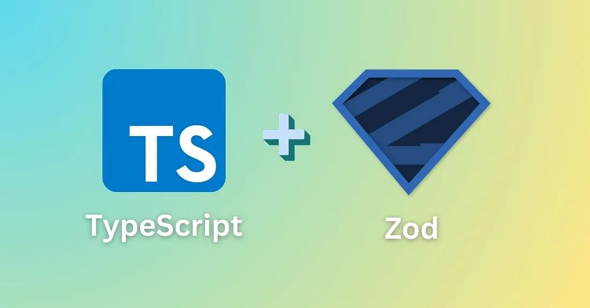
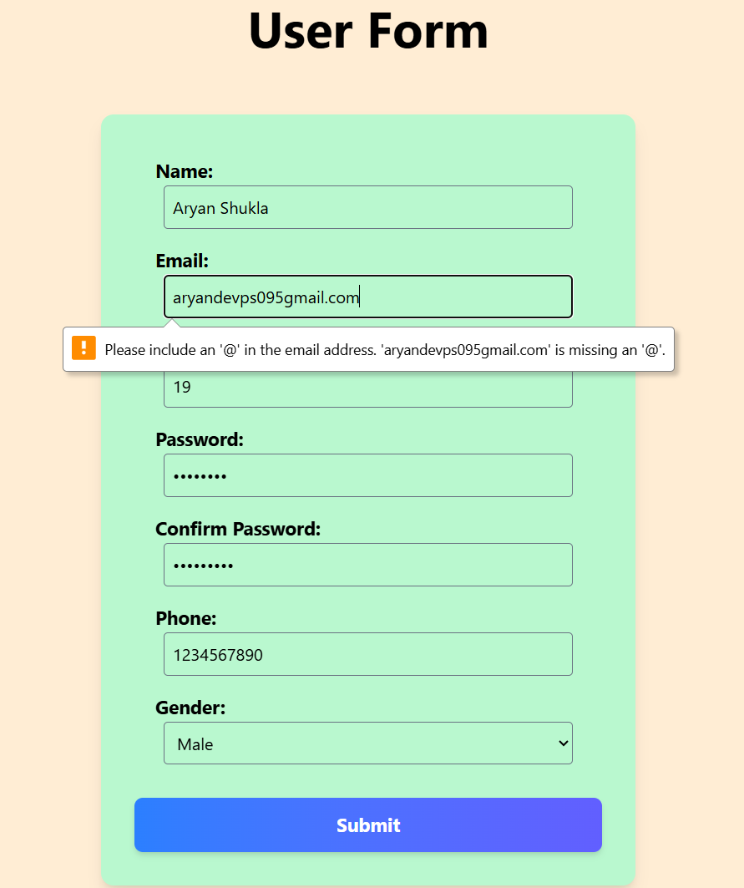
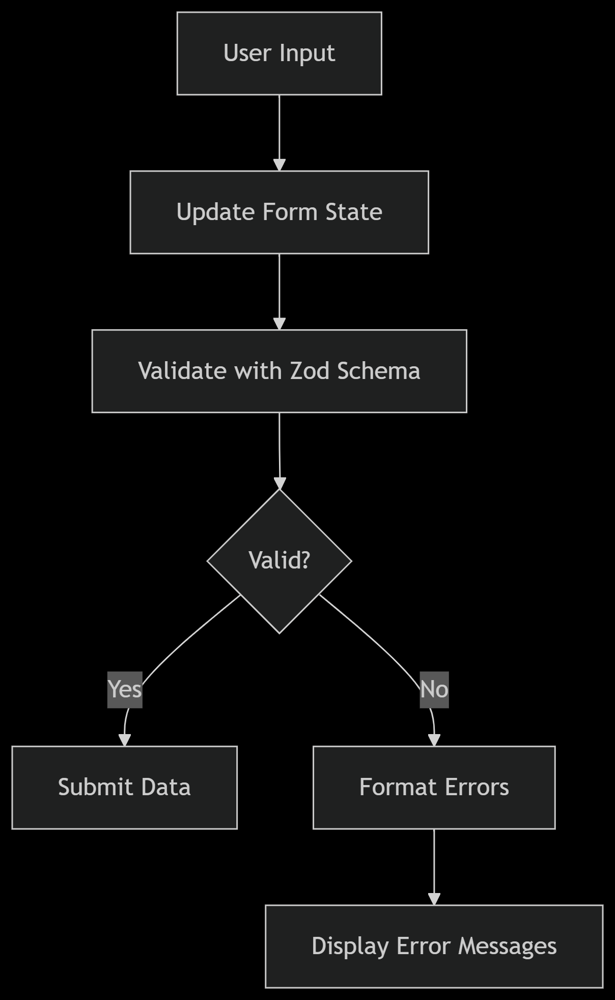

 # React Form Validation with Zod 🔒

  
 
A practical implementation of robust form validation using Zod schemas in a React application with TypeScript.
Zod is a TypeScript-first schema validation library that helps you define and validate data structures with strong typing and runtime validation.
It is designed to be declarative, type-safe, and developer-friendly.

## 📋 Table of Contents
- [Features](#-features)
- [Installation](#-installation)
- [About Zod](#-about-zod-validation-library)
- [Project Structure](#-project-structure)
- [Validation Workflow](#-validation-workflow)
- [Learning Journey](#-learning-journey)
- [Limitations](#-limitations)
- [References](#-references)
- [License](#-license)


## ✨ Features
- **Zod Schema Validation** with custom error messages
- **Type-safe form state** management
- **Real-time validation feedback**
- **Cross-field validation** (password matching)
- **10+ validation rules** including:
  - Required fields
  - Email format validation
  - Minimum age restriction (18+)
  - Password complexity requirements
  - Phone number length validation
- **Responsive UI** with Tailwind CSS
- **Error state management** with React hooks


## 🛠 Installation

```
# Clone repository
git clone https://github.com/your-username/zod-form-validation.git

# Install dependencies
npm install

# Start development server
npm run dev
```


Visit **http://localhost:5173** to view the form.


  


# 📚 About Zod Validation Library

 **Why Zod?**

Zod is a TypeScript-first schema declaration and validation library that provides:

Type Safety: Automatic TypeScript type inference

Chainable API: Easy-to-read validation pipelines

Custom Error Messages: Human-readable validation feedback

Composable Schemas: Reusable validation rules

Zero Dependencies: Lightweight package


# Key Zod Concepts Implemented


1. Schema Definition

```
// types/userform.ts
export const userFormSchema = z.object({
  email: z.string()
    .min(1, "Email is required")
    .email("Invalid email address"),
    
  password: z.string()
    .min(8, "Password must be at least 8 characters")
    .regex(/[A-Z]/, "Must contain at least one uppercase letter")
    .regex(/[0-9]/, "Must contain at least one number"),
    
  age: z.number()
    .min(18, "Must be at least 18 years old")
    .max(120, "Enter valid age"),
}).refine(/* password matching logic */);
```


2. Validation Process
```
const validateForm = (data: UserForm) => {
  const result = userFormSchema.safeParse(data);
  
  if (!result.success) {
    const errors = result.error.issues.reduce((acc, issue) => {
      const path = issue.path[0] as keyof UserForm;
      acc[path] = issue.message;
      return acc;
    }, {} as FormErrors);
    
    return { isValid: false, errors };
  }
  
  return { isValid: true, errors: null };
};

```


3. Error Handling

```
// Custom error formatting utility
const formatZodError = (zodError: z.ZodError) => {
  return zodError.issues.reduce((acc, issue) => {
    const field = issue.path[0];
    acc[field as keyof UserForm] = issue.message;
    return acc;
  }, {} as FormErrors);
};
```


# 🗂 Project Structure

```
/src
├── components
│   └── UserForm.tsx       # Main form component
├── types
│   └── userform.ts        # Zod schemas and type definitions
├── utils
│   └── validation.ts      # Validation logic helpers
└── App.tsx                # Root component

```


🔄 Validation Workflow





# 🎓 Learning Journey


# Key Learnings

1. Type-Safe Validation

    -> Zod's automatic type inference reduced runtime errors

    -> TypeScript integration caught validation issues during development


2. Custom Validation Logic

  -> Implemented cross-field validation with .refine()

```
.refine(data => data.password === data.confirmPassword, {
  message: "Passwords must match",
  path: ["confirmPassword"]
})
```


3. Error Handling Patterns

Developed reusable error formatting utilities

Implemented real-time validation feedback system


4. Schema Composition

Created reusable validation rules across fields

Maintained DRY (Don't Repeat Yourself) principles


5. Developer Experience

Zod's chainable API improved code readability

Automatic error typing enhanced IDE support


# Challenges Overcome
 -> Password Complexity Validation
   Combined multiple regex validations in single field

-> Type Conversion
   Handled number/string conversions for form inputs

-> Error State Management
  Developed efficient error clearing during user input


# ⚠ Limitations


Currently handles synchronous validation only

No server-side validation integration

Limited to basic input types

No internationalization support for errors


# 📚 References

**Zod Documentation**

**React Forms Guide**

**TypeScript Handbook**


# 📄 License
MIT License - See LICENSE for details.

Developed with 💡 by Aryan Shukla
 
